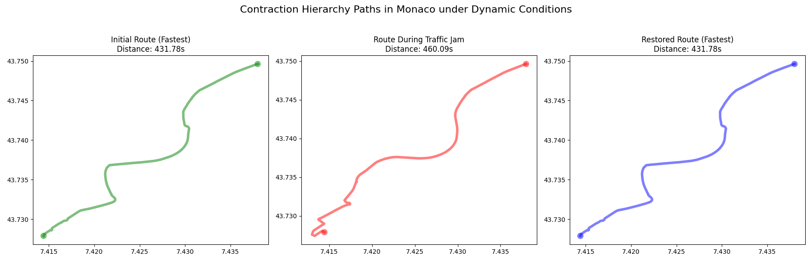
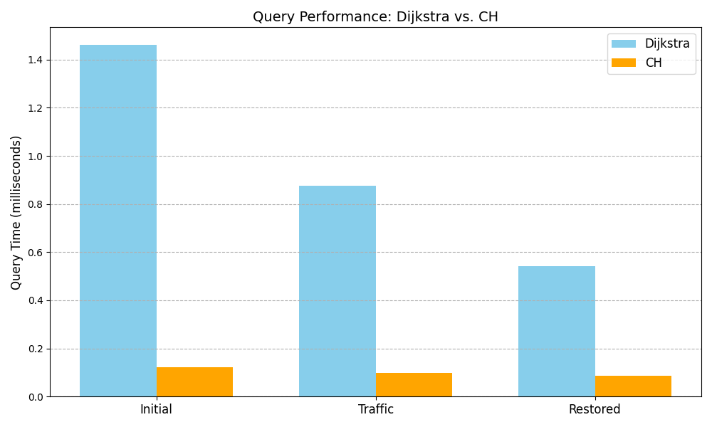

# Dynamic Contraction Hierarchies (DCH)

An implementation of **Contraction Hierarchies** designed to handle **dynamic edge weight updates** (e.g., traffic jams) without requiring a full graph rebuild. This project demonstrates how to maintain sub-millisecond query times on real-world road networks even when traffic conditions change in real-time.

## How it works

1. Preprocessing: Nodes are ordered by importance (heuristic based on edge difference, Voronoi region size, etc.). Nodes are "contracted" one by one; if removing a node destroys a shortest path, a shortcut edge is added to preserve distances.

2. Querying: A bidirectional Dijkstra search runs on the upward_graph (from source) and downward_graph (from target), meeting at the highest-ranked node in the path.

3. Dynamic Updates:

    - Identify: When an edge weight changes, the system identifies all shortcuts that depend on it.

    - Invalidate: Affected shortcuts are removed from the search graphs and the internal overlay graph.

    - Re-contract: The endpoints of the changed edge—and any "via" nodes of affected shortcuts—are re-contracted locally to generate new valid shortcuts. This ensures that deep dependencies (shortcuts built on top of other shortcuts) are correctly rebuilt.
    
## Architecture

- ch.py: Core ContractionHierarchy class containing logic for contraction, witness search, querying, and dynamic updates.

- ex.py: Example script that loads Monaco data, runs the simulation, and generates the plots.


## Performance & Visualization

The implementation was tested on the road network of **Monaco**. Below are the results comparing the Contraction Hierarchy (CH) against standard Dijkstra search across three network states: **Initial**, **Traffic Jam**, and **Restored**.

### 1. Route Adaptation
The system correctly reroutes around traffic jams and restores the optimal path once traffic clears.



* **Left (Green):** The initial optimal path (431.78s).
* **Center (Red):** A traffic jam increases edge weight significantly. The CH finds a new optimal detour (460.09s).
* **Right (Blue):** Traffic clears. The CH updates dynamically and recovers the original optimal path (431.78s).

### 2. Query Latency
Contraction Hierarchies consistently outperform Dijkstra by an order of magnitude, maintaining **sub-millisecond** response times even after dynamic updates.




## Installation & Usage

```bash
pip install networkx osmnx matplotlib scipy
python ex.py
```

### Execution output
```
downloading real-world data for Monaco...
        graph ready: 365 nodes, 644 edges.
building hierarchy
initializing voronoi regions and priorities
contracting nodes (lazy updates)
built CH with 686 shortcuts in 0.0474s

querying 25177730 -> 13194560023
fixed route: 25177730 -> 13194560023
     dijkstra: 431.78s (1.245ms)
     CH: 431.78s (0.188ms)
     [PASS] exact match.

[a] traffic on edge (6444966511,12851688376)
   old weight: 4.20s -> new weight: 209.77s
dynamic update: (6444966511, 12851688376) -> 209.7730263258457
     dijkstra: 460.09s (0.649ms)
     CH: 460.09s (0.102ms)
     [PASS] exact match.

[b] restore
dynamic update: (6444966511, 12851688376) -> 4.195460526516914
     dijkstra: 431.78s (0.520ms)
     CH: 431.78s (0.089ms)
     [PASS] exact match.
```
